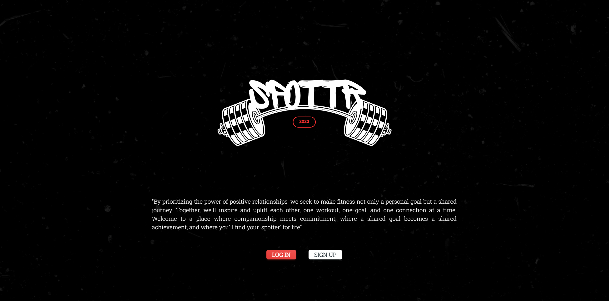
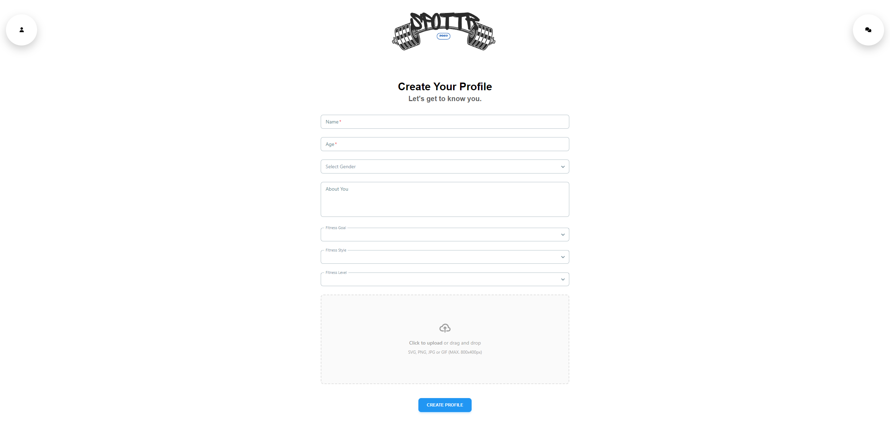
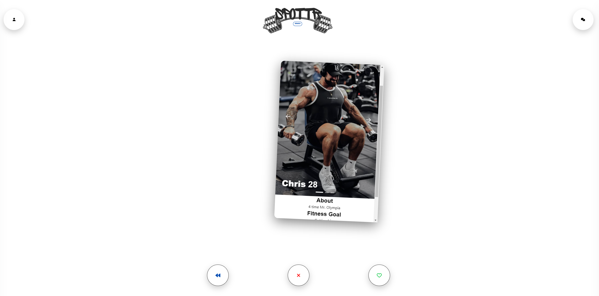

# Spottr

**Spottr** is a dating app for fitness enthusiasts looking to forge meaningful connections on their fitness journey. Whether you're a novice looking for guidance, a motivated beginner eager to start alongside a like-minded partner, or an experienced athlete searching for a workout buddy, Spottr seeks to help find your fitness match, someone who shares your fitness goals, interests, & passion for health and wellness.

**Match. Sweat. Inspire**

## Screenshots

## Getting Started

Click [here](https://spottr2-842d09486686.herokuapp.com/) to explore the application. You will need to sign up and create a profile to start connecting with other users. Create a profile that really describes yourself and your goals! Then get to swiping. You'll be able to see your matches on the right navigation pane and interact with your matches (chat feature will be developed soon). Hope you find your spotter!

## Technologies Used
**Languages:** JavaScript, HTML, CSS, Node.js, Express.js, Mongoose, MongoDB, React, Tailwind CSS, AWS S3

**IDE:** VSCode

## Future Features
* geolocation service/api: 
  Only serve profiles in a selected range
* filter by preferences:
  Be able to narrow the profiles you see by preferences you set when creating your profile.
* Socket.IO:
  The most important feature to a social app like this - the ability to interact with your matches.
* Rewind:
  We all want the ability to get a second chance. Go back to a previous profile you disliked.
* refactoring code

## Known Bugs
* when application fetches profiles, it may serve duplicates and profiles you previously disliked/liked.